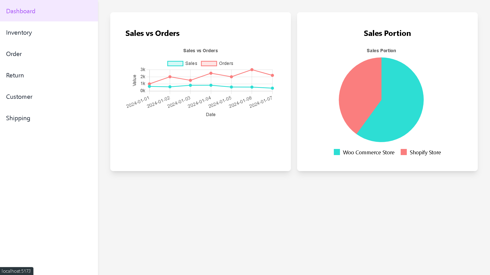
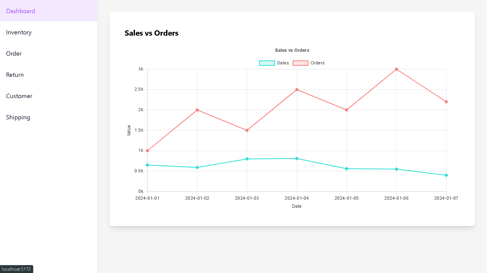
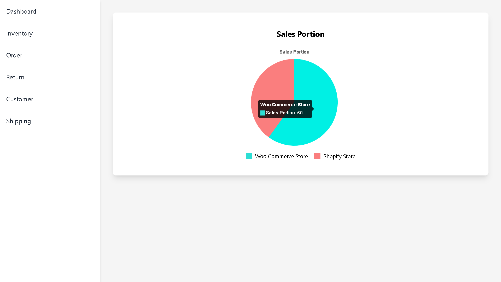
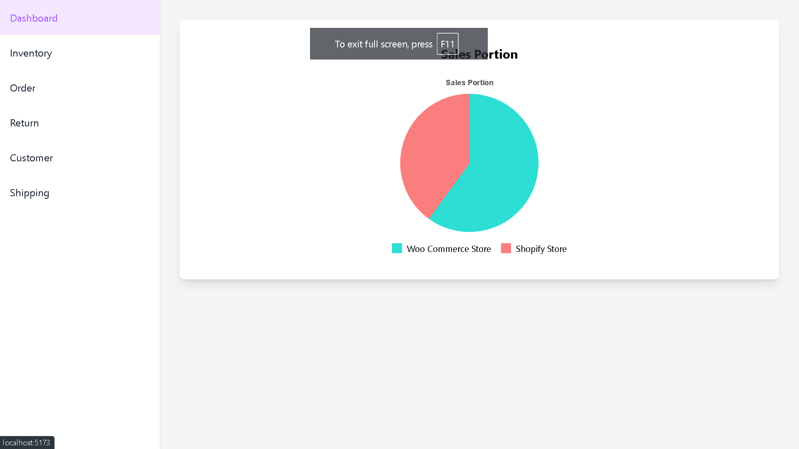

Here’s a simple README file that provides an overview of your React project, its components, and how to set it up:

---

# React Dashboard Project

## Overview

This React project includes a dashboard with various components such as a sidebar for navigation, a line chart for sales vs. orders, and a pie chart for sales portions. The project is styled using Tailwind CSS and utilizes Chart.js for data visualization.






## Features

- **Sidebar**: Navigation with links to different sections (Dashboard, Inventory, Order, Return, Customer, Shipping).
- **Dashboard**: Displays a line chart comparing sales and orders.
- **Sales Portion Pie Chart**: Shows the distribution of sales between Woo Commerce Store and Shopify Store.

## Technologies Used

- **React**: JavaScript library for building user interfaces.
- **Tailwind CSS**: Utility-first CSS framework for styling.
- **Chart.js**: JavaScript library for creating charts.
- **React Router DOM**: For routing and navigation.

## Setup

1. **Clone the Repository**

   ```bash
   git clone https://github.com/developerashish02/adapt-nxt-assignment.git
   ```

2. **Navigate to the Project Directory**

   ```bash
   cd adapt-nxt-assignment
   ```

3. **Install Dependencies**

   ```bash
   npm install
   ```

4. **Start the Development Server**

   ```bash
   npm run dev
   ```

   Open your browser and go to `http://localhost:3000` to view the application.

## Components

### Sidebar

Located in `src/components/SideBar.js`, the sidebar provides navigation links to different sections.

### Dashboard

Located in `src/components/Dashboard.js`, this component displays a line chart comparing sales and orders.

### SalesPieChart

Located in `src/components/SalesPieChart.js`, this component shows a pie chart of sales distribution between Woo Commerce Store and Shopify Store.

## Constants

The chart data and options are defined in `src/constants.js` to keep the components clean and organized.

## License

This project is licensed under the MIT License.

---

# adapt-nxt-assignment
